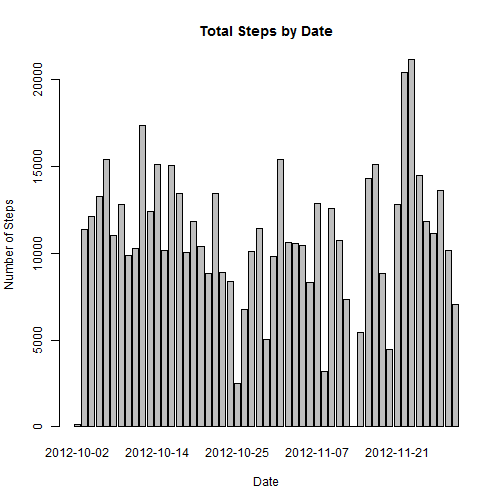
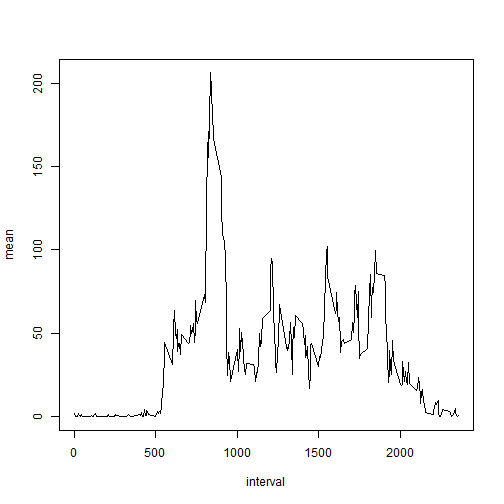
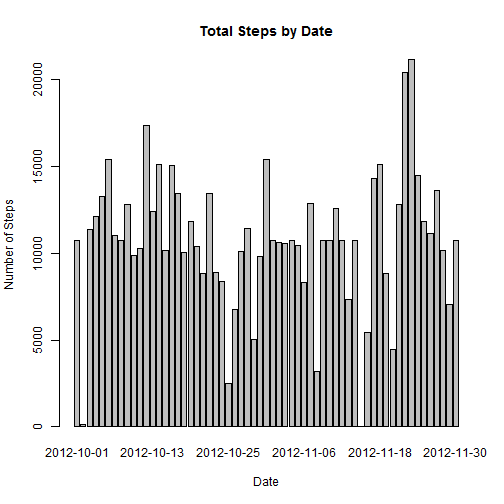
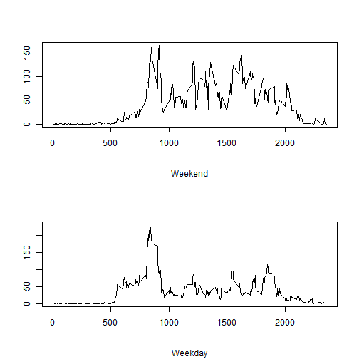

# Reproducible Research: Peer Assessment 1

## Loading and preprocessing the data

```r
filename <- "../data/activity.csv"
rawdata <- read.csv(filename)
nadata <- rawdata[is.na(rawdata$steps), ]
withdata <- rawdata[!is.na(rawdata$steps), ]
```


## What is mean total number of steps taken per day?
Here is the total steps taken every day

```r
totalbydate <- aggregate(x = withdata$steps, by = list(withdata$date), FUN = "sum")
names(totalbydate) <- c("date", "total")
barplot(totalbydate$total, names.arg = totalbydate$date, main = "Total Steps by Date", xlab = "Date", ylab = "Number of Steps")
```

 

Average total steps taken every days: 

```r
mean(totalbydate$total)
```

```
## [1] 10766
```

Mean and median number of steps taken each day

```r
allbydate <- aggregate(x = totalbydate$total, by = list(totalbydate$date), function(x) cbind(mean(x), median(x)))
head(allbydate)
```

```
##      Group.1   x.1   x.2
## 1 2012-10-02   126   126
## 2 2012-10-03 11352 11352
## 3 2012-10-04 12116 12116
## 4 2012-10-05 13294 13294
## 5 2012-10-06 15420 15420
## 6 2012-10-07 11015 11015
```

## What is the average daily activity pattern?
Time series plot of the average number of steps taken (averaged across all days) versus the 5-minute intervals

```r
meanbyinterval <- aggregate(x = withdata$steps, by = list(withdata$interval), FUN = "mean")
names(meanbyinterval) <- c("interval", "mean")
    
plot(meanbyinterval, type = "l")
```

 

Following is the 5-min interval that contains the maximum number of steps on average across all the days. 

```r
maxmeaninterva <- meanbyinterval[which(meanbyinterval$mean == max(meanbyinterval$mean)), ]
maxmeaninterva
```

```
##     interval  mean
## 104      835 206.2
```

## Imputing missing values
Total number of missing value is: 

```r
nrow(nadata)
```

```
## [1] 2304
```

To fill in all of the missing value: I used the mean value of that 5-min interval

```r
meanbyinterval <- cbind(meanbyinterval, "roundingmean" = round(meanbyinterval$mean, digits = 0))
nadatanew <- merge(nadata, meanbyinterval, by = "interval", all.x = TRUE)
nadatanew <- nadatanew[, c(5, 3, 1)]
names(nadatanew) <- c("steps", "date", "interval")
```

Create a new dataset that is equal to the original dataset but with the missing data filled in.

```r
datanew <- rbind(withdata, nadatanew)
head(datanew)
```

```
##     steps       date interval
## 289     0 2012-10-02        0
## 290     0 2012-10-02        5
## 291     0 2012-10-02       10
## 292     0 2012-10-02       15
## 293     0 2012-10-02       20
## 294     0 2012-10-02       25
```

Make a histogram of the total number of steps taken each day and Calculate and report the mean and median total number of steps taken per day.

```r
totalbydatenew <- aggregate(x =datanew$steps, by = list(datanew$date), FUN = "sum")
names(totalbydatenew) <- c("date", "total")
barplot(totalbydatenew$total, names.arg = totalbydatenew$date, main = "Total Steps by Date", xlab = "Date", ylab = "Number of Steps")
```

 

Here is the report of the mean and median total number of steps for each day

```r
allbydatenew <- aggregate(x = totalbydatenew$total, by = list(totalbydatenew$date), function(x) cbind(mean(x), median(x)))
head(allbydatenew)
```

```
##      Group.1   x.1   x.2
## 1 2012-10-01 10762 10762
## 2 2012-10-02   126   126
## 3 2012-10-03 11352 11352
## 4 2012-10-04 12116 12116
## 5 2012-10-05 13294 13294
## 6 2012-10-06 15420 15420
```

Compare to previous result, the difference of the same day is very small or no difference, because we fill in with average of the interval; but for those dates that have missing value for all intervals, the differences are dramatic, like 2012-10-01. 

## Are there differences in activity patterns between weekdays and weekends?

Create a new factor variable in the dataset with two levels - "weekday" and "weekend" indicating whether a given date is a weekday or weekend day.

```r
weekend <- weekdays(as.Date(datanew$date)) == "Saturday" | weekdays(as.Date(datanew$date)) == "Sunday"
datanew <- cbind(datanew, "Weekend" = weekend)
head(datanew)
```

```
##     steps       date interval Weekend
## 289     0 2012-10-02        0   FALSE
## 290     0 2012-10-02        5   FALSE
## 291     0 2012-10-02       10   FALSE
## 292     0 2012-10-02       15   FALSE
## 293     0 2012-10-02       20   FALSE
## 294     0 2012-10-02       25   FALSE
```

Make a panel plot containing a time series plot (i.e. type = "l") of the 5-minute interval (x-axis) and the average number of steps taken, averaged across all weekday days or weekend days (y-axis). 


```r
meanbyintervalnew <- aggregate(x = datanew$steps, by = list(datanew$interval, datanew$Weekend), FUN = "mean")
names(meanbyintervalnew) = c("interval", "Weekend", "mean")
meanbyintervalnewweekday <- meanbyintervalnew[which(meanbyintervalnew$Weekend == "FALSE"), ]
meanbyintervalnewweekend <- meanbyintervalnew[which(meanbyintervalnew$Weekend == "TRUE"), ]
    
par(mfrow = c(2, 1))
plot(meanbyintervalnewweekend$interval, meanbyintervalnewweekend$mean, type = "l", sub = "Weekend", xlab = "", ylab = "")
plot(meanbyintervalnewweekday$interval, meanbyintervalnewweekday$mean, type = "l", sub = "Weekday", xlab = "", ylab = "")
```

 

From above plots, we can find: 
- Before 5AM and after 10PM, the pattern are similar, because people go to sleep during that period of time; 
- Between 5Am and 10PM, the weekend plot shows big difference from weekday plots.
